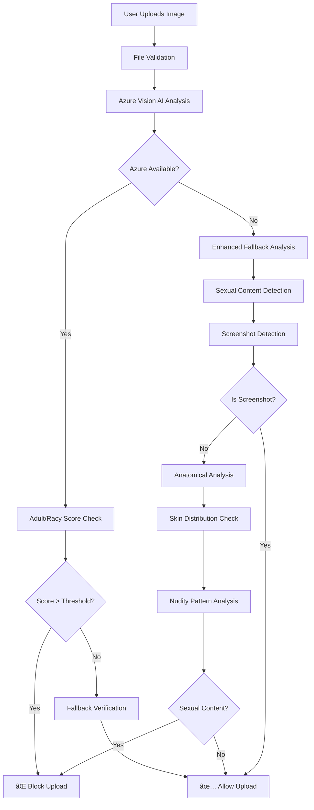
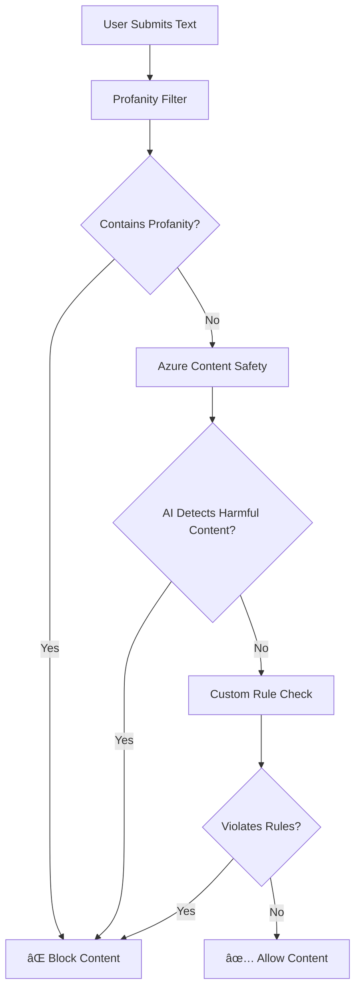

# Social Sphere

A modern social media platform with **advanced AI-powered content moderation capabilities**, built with React (Frontend) and Node.js (Backend).

## Features

- **Real-time Messaging** - Chat with friends using Socket.IO
- **Post Creation & Sharing** - Share text and images with your network
- **Stories** - Share temporary content that disappears after 24 hours
- **Gaming Integration** - Play games like Chess, Ludo, and Uno
- **🛡️ Advanced Content Moderation** - Multi-layer AI-powered text and image filtering system
- **🔍 Sexual Content Detection** - Specialized detection for explicit content (nudity, sexual imagery)
- **📸 Screenshot Detection** - Intelligent differentiation between legitimate screenshots and inappropriate content
- **Friend Management** - Connect with other users
- **User Authentication** - Secure JWT-based authentication with email verification

## 🛡️ Advanced Content Moderation System

Social Sphere implements a **state-of-the-art multi-layer content moderation system** designed to block sexual/adult content while preserving legitimate user content.

### 🚫 What Gets Blocked

- ❌ **Sexual Content**: Images containing exposed genitalia (penis, vagina)
- ❌ **Nudity**: Exposed breasts, buttocks, and intimate body parts
- ❌ **Adult Content**: Sexual poses, explicit imagery, pornographic material
- ❌ **Inappropriate Text**: Profanity, hate speech, sexual content

### ✅ What Gets Allowed

- ✅ **Screenshots**: Automatically detected and allowed (UI elements, text content)
- ✅ **Normal Photos**: Regular selfies, group photos, nature images
- ✅ **Social Media Content**: Profile pictures, vacation photos, food images
- ✅ **Clothed Images**: Beach photos, sports images with appropriate coverage

## 🔍 Image Moderation Architecture

### Primary Detection Layer: Azure Vision AI
```
User Upload → Azure Vision API → Adult/Racy Score Analysis → Decision
```

### Advanced Fallback: Enhanced Sexual Content Analyzer
```
Azure Failure → Enhanced AI Analysis → Sexual Content Detection → Decision
```

### 🧠 Enhanced Sexual Content Detection

Our proprietary **Enhanced Image Analyzer** uses advanced algorithms to detect sexual content:

#### 1. **Anatomical Region Analysis**
- **Breast Detection**: Identifies exposed breast patterns and nipple visibility
- **Genital Detection**: Analyzes lower body regions for genital exposure
- **Intimate Area Mapping**: Focuses on body regions typically covered by clothing

#### 2. **Skin Distribution Analysis**
```javascript
// Example analysis regions
const regions = {
  intimateArea: 'Center region analysis',
  chestArea: 'Upper body breast detection',  
  lowerArea: 'Genital region analysis',
  overall: 'General skin tone distribution'
};
```

#### 3. **Nudity Pattern Recognition**
- **Continuous Skin Areas**: Detects large areas of unclothed skin
- **Clothing Boundary Detection**: Identifies absence of fabric-to-skin transitions
- **Nude Photography Patterns**: Analyzes color distributions typical of nude content

#### 4. **Sexual Composition Analysis**
- **Pose Detection**: Identifies sexually suggestive positions
- **Body Part Concentration**: Analyzes focus on intimate body regions
- **Aspect Ratio Analysis**: Portrait orientations with high skin exposure

### 📸 Intelligent Screenshot Detection

Prevents false positives by auto-detecting legitimate screenshots:

```javascript
const screenshotIndicators = {
  aspectRatio: [16/9, 16/10, 4/3, 3/2], // Common screen ratios
  format: 'PNG',                        // Screenshot format
  highContrast: true,                   // Text/UI elements
  lowSkinContent: '<15%',               // Minimal human content
  fileSize: '50KB-5MB'                  // Typical screenshot size
};
```

### ⚙️ Configuration Options

#### Environment Variables (.env)
```env
# === CONTENT MODERATION SETTINGS ===

# Enable/Disable Moderation
ENABLE_IMAGE_MODERATION=true
STRICT_MODERATION=false

# Azure Vision AI Configuration
AZURE_VISION_ENDPOINT=https://your-vision-service.cognitiveservices.azure.com/
AZURE_VISION_KEY=your_azure_vision_api_key

# Detection Thresholds (0.0 = most strict, 1.0 = most permissive)
ADULT_THRESHOLD=0.15              # Primary adult content threshold
RACY_THRESHOLD=0.15               # Sexually suggestive content threshold
SKIN_TONE_THRESHOLD=0.2           # Skin exposure sensitivity
EDGE_COMPLEXITY_THRESHOLD=0.3     # Pattern analysis sensitivity
SEXUAL_CONTENT_THRESHOLD=0.7      # Explicit content detection threshold

# Azure Content Safety (Text Moderation)
AZURE_CONTENT_SAFETY_KEY=your_content_safety_key
AZURE_CONTENT_SAFETY_ENDPOINT=https://your-content-safety.cognitiveservices.azure.com/
```

#### Moderation Sensitivity Levels

**🔴 High Security (Recommended for Family-Safe Platforms)**
```env
ADULT_THRESHOLD=0.1
RACY_THRESHOLD=0.1
SKIN_TONE_THRESHOLD=0.15
SEXUAL_CONTENT_THRESHOLD=0.6
```

**🟡 Balanced (Recommended for General Social Media)**
```env
ADULT_THRESHOLD=0.15
RACY_THRESHOLD=0.15
SKIN_TONE_THRESHOLD=0.2
SEXUAL_CONTENT_THRESHOLD=0.7
```

**🟢 Relaxed (For Adult-Oriented Platforms)**
```env
ADULT_THRESHOLD=0.3
RACY_THRESHOLD=0.3
SKIN_TONE_THRESHOLD=0.4
SEXUAL_CONTENT_THRESHOLD=0.8
```

## 📝 Text Moderation System

### Multi-Layer Text Analysis

#### 1. **Profanity Detection**
```javascript
// Using enhanced bad-words library
const Filter = require('bad-words');
const filter = new Filter();
const cleanText = filter.clean(userInput);
```

#### 2. **Azure Content Safety Integration**
```javascript
// AI-powered text analysis
const response = await contentSafetyClient.analyzeText({
  text: userInput,
  categories: ['Hate', 'Sexual', 'Violence', 'SelfHarm']
});
```

#### 3. **Custom Rule-Based Filtering**
- Sexual content keywords
- Hate speech detection
- Harassment prevention
- Spam identification

## 🚀 Quick Setup Guide

### 1. Backend Setup
```bash
cd Backend
npm install
```

### 2. Environment Configuration
```bash
cp .env.example .env
# Edit .env with your API keys and database configuration
```

### 3. Database Setup
```bash
# PostgreSQL database setup
createdb "Social Sphere"
# Run migrations (if any)
```

### 4. Start Backend Server
```bash
npm start
# Server runs on http://localhost:3000
```

### 5. Frontend Setup
```bash
cd Client
npm install
npm run dev
# Frontend runs on http://localhost:5173
```

## 🔧 API Endpoints

### Content Moderation Endpoints

#### Image Upload with Moderation
```http
POST /api/posts/create
Content-Type: multipart/form-data

{
  "user_id": "123",
  "content": "Post description",
  "privacy_setting": "public",
  "image": [FILE]
}
```

**Response (Approved)**:
```json
{
  "message": "Post created successfully",
  "post_id": 456,
  "media_url": "https://cloudinary.com/image.jpg"
}
```

**Response (Blocked)**:
```json
{
  "error": "Post rejected: Image contains prohibited content",
  "moderation_details": {
    "reason": "High skin concentration in intimate areas: 65.2%",
    "confidence": 85.3,
    "method": "Enhanced Sexual Content Detection"
  }
}
```

#### Test Moderation (Development)
```http
POST /api/posts/test-moderation
Content-Type: multipart/form-data

{
  "image": [FILE]
}
```

### User Management
```http
POST /api/users/register      # User registration
POST /api/users/login         # User login
GET  /api/users/profile/:id   # Get user profile
```

### Posts & Content
```http
GET  /api/posts/all           # Get all posts
POST /api/posts/create        # Create new post (with moderation)
GET  /api/posts/:id           # Get specific post
```

### Real-time Messaging
```http
GET  /api/messages/history    # Get message history
POST /api/messages/send       # Send message (with text moderation)
```

## 🏗️ Project Architecture

```
Social Sphere/
├── Backend/
│   ├── auth/                           # Authentication & Security
│   │   ├── authCheck.js               # JWT verification middleware
│   │   ├── createJWT.js               # Token generation
│   │   ├── multer.js                  # File upload handling
│   │   └── UserVerification.js        # Email verification
│   ├── config/
│   │   ├── db.js                      # PostgreSQL configuration
│   │   └── socket.js                  # Socket.IO real-time setup
│   ├── controller/                     # Business Logic Layer
│   │   ├── posts.js                   # 🛡️ Post creation with moderation
│   │   ├── users.js                   # User management
│   │   ├── friends.js                 # Friend system
│   │   ├── messages.js                # 🛡️ Messaging with text moderation
│   │   ├── stories.js                 # Stories functionality
│   │   └── events.js                  # Event management
│   ├── model/                         # Database Models
│   │   ├── posts.js                   # Post data model
│   │   ├── users.js                   # User data model
│   │   ├── friends.js                 # Friend relationships
│   │   ├── messages.js                # Message storage
│   │   └── stories.js                 # Stories data
│   ├── route/                         # API Route Definitions
│   │   ├── posts.js                   # Post-related endpoints
│   │   ├── users.js                   # User endpoints
│   │   ├── friends.js                 # Friend management
│   │   ├── messages.js                # Messaging endpoints
│   │   └── stories.js                 # Stories endpoints
│   ├── services/                      # 🛡️ Moderation Services
│   │   ├── imageModerationService.js  # Azure Vision AI integration
│   │   ├── fallbackImageModerationService.js # Backup moderation
│   │   ├── enhancedImageAnalyzer.js   # 🔥 Advanced sexual content detection
│   │   └── moderationService.js       # Text content moderation
│   ├── utility/
│   │   └── cloudinary.js              # Image storage (Cloudinary)
│   ├── uploads/                       # Temporary file storage
│   └── server.js                      # Main server entry point
├── Client/                            # React Frontend
│   ├── src/
│   │   ├── components/                # Reusable UI components
│   │   │   ├── ui/                    # Core UI elements
│   │   │   │   ├── CreatePostContainer.jsx # 🛡️ Post creation with moderation
│   │   │   │   ├── PostContainer.jsx       # Post display
│   │   │   │   └── Stories.jsx             # Stories interface
│   │   │   └── Gaming/                # Game integration
│   │   ├── pages/                     # Main application pages
│   │   │   ├── Messenger.jsx          # 🛡️ Real-time messaging
│   │   │   ├── Profile.jsx            # User profiles
│   │   │   └── [Games].jsx            # Chess, Ludo, Uno games
│   │   ├── users/                     # Authentication pages
│   │   │   ├── login.jsx              # User login
│   │   │   ├── signUp.jsx             # User registration
│   │   │   └── VerifyUser.jsx         # Email verification
│   │   ├── store/                     # State management
│   │   │   ├── useAuthStore.js        # Authentication state
│   │   │   └── useMessageStore.js     # Message state
│   │   └── lib/                       # Utilities & helpers
│   │       ├── axios.js               # API client configuration
│   │       ├── AuthRedirect.jsx       # Auth routing
│   │       └ProtectRoute.jsx          # Route protection
│   └── public/                        # Static assets
└── Documentation/                     # Project documentation
    ├── MODERATION_GUIDE.md           # 🛡️ Detailed moderation setup
    ├── API_DOCUMENTATION.md          # API reference
    └── DEPLOYMENT_GUIDE.md           # Production deployment
```

## 🔍 Moderation System Flow

### Image Processing Pipeline



### Text Processing Pipeline



## 🛡️ Security Features

### Image Security
- **File Type Validation**: Only allows safe image formats (JPEG, PNG, GIF, WebP)
- **File Size Limits**: Prevents oversized uploads (max 10MB)
- **Header Verification**: Validates actual file format vs extension
- **Malware Prevention**: Basic file structure validation
- **Rate Limiting**: Prevents spam uploads

### Text Security
- **XSS Prevention**: Input sanitization and validation
- **SQL Injection Protection**: Parameterized queries
- **Rate Limiting**: Message flood prevention
- **Content Length Limits**: Prevents oversized text submissions

### API Security
- **JWT Authentication**: Secure token-based authentication
- **CORS Configuration**: Controlled cross-origin requests
- **Input Validation**: Comprehensive request validation
- **Error Handling**: Secure error responses (no sensitive data exposure)

## 📊 Monitoring & Analytics

### Moderation Metrics
- **Block Rate**: Percentage of content blocked
- **False Positive Rate**: Legitimate content incorrectly blocked
- **Detection Accuracy**: Correctly identified inappropriate content
- **Response Time**: Moderation processing speed

### Logging System
```javascript
// Example moderation log entry
{
  "timestamp": "2025-07-20T10:30:00Z",
  "user_id": "user123",
  "content_type": "image",
  "moderation_result": "blocked",
  "reason": "High skin concentration in intimate areas: 65.2%",
  "confidence": 85.3,
  "method": "Enhanced Sexual Content Detection",
  "processing_time": "1.2s"
}
```

## 🚨 Troubleshooting

### Common Issues

#### 1. **All Images Being Blocked**
```bash
# Check configuration
STRICT_MODERATION=false  # Should be false for normal operation
ADULT_THRESHOLD=0.15     # Adjust if too strict (higher = more permissive)
```

#### 2. **Adult Content Getting Through**
```bash
# Tighten thresholds
ADULT_THRESHOLD=0.1      # Lower values = more strict
SEXUAL_CONTENT_THRESHOLD=0.6  # Lower values = more strict
```

#### 3. **Screenshots Being Blocked**
```bash
# Verify screenshot detection is working
# Check logs for "Screenshot detection score"
# Should show high scores (>60) for actual screenshots
```

#### 4. **Azure Vision Errors**
```bash
# Check Azure credentials
AZURE_VISION_ENDPOINT=correct_endpoint
AZURE_VISION_KEY=valid_api_key

# Verify Azure service is available
curl -H "Ocp-Apim-Subscription-Key: YOUR_KEY" \
     "YOUR_ENDPOINT/vision/v3.2/analyze?visualFeatures=Adult"
```

### Debug Mode

Enable detailed logging for troubleshooting:

```javascript
// In your .env file
DEBUG_MODERATION=true
VERBOSE_LOGGING=true
```

## 🤝 Contributing

### Moderation System Improvements

1. **Enhanced Detection Algorithms**
   - Improve anatomical shape detection
   - Add machine learning model training
   - Enhance screenshot detection accuracy

2. **Performance Optimization**
   - Implement image preprocessing
   - Add result caching mechanisms
   - Optimize processing pipeline

3. **New Features**
   - Video content moderation
   - Audio content filtering
   - Advanced AI model integration

### Development Setup

```bash
# Clone repository
git clone https://github.com/yourusername/social-sphere.git

# Setup development environment
cd social-sphere
npm run setup:dev

# Run tests
npm run test:moderation

# Start development servers
npm run dev
```

## 📄 License

This project is licensed under the MIT License - see the [LICENSE](LICENSE) file for details.

## 🙏 Acknowledgments

- **Azure Cognitive Services** - For AI-powered content analysis
- **Sharp** - For high-performance image processing  
- **Cloudinary** - For reliable image storage and delivery
- **Socket.IO** - For real-time communication
- **PostgreSQL** - For robust data storage

## 📞 Support

For questions about the moderation system or technical support:

- **Email**: support@socialsphere.com
- **Documentation**: [Moderation Guide](./MODERATION_GUIDE.md)
- **Issues**: [GitHub Issues](https://github.com/yourusername/social-sphere/issues)

---

**Built with ❤️ for creating safe online communities**

1. **Upload Detection** - When a user uploads an image
2. **Azure Vision Analysis** - Image is sent to Azure Vision API for adult content analysis
3. **Score Evaluation** - Adult and racy scores are compared against thresholds
4. **Fallback Protection** - If Azure fails, fallback validation checks:
   - File size validation
   - Image header verification
   - Format validation
5. **Decision Making** - Content is either approved or rejected
6. **Safe Defaults** - When in doubt, content is blocked to maintain safety

#### API Endpoints:

- `POST /api/posts/create` - Create new post with optional image
- `POST /api/posts/test-moderation` - Test image moderation (development only)

### Text Moderation

Text content is filtered using multiple approaches:

- **Profanity Detection** - Using the `bad-words` library
- **Azure Content Safety** - AI-powered text analysis (when configured)
- **Custom Filters** - Additional rule-based filtering

## Project Structure

```
Social Sphere/
├── Backend/
│   ├── auth/                   # Authentication middleware
│   │   ├── authCheck.js       # JWT verification
│   │   ├── createJWT.js       # Token generation
│   │   ├── multer.js          # File upload handling
│   │   └── UserVerification.js # Email verification
│   ├── config/
│   │   ├── db.js              # Database configuration
│   │   └── socket.js          # Socket.IO setup
│   ├── controller/            # Business logic
│   │   ├── posts.js           # Post management with moderation
│   │   ├── users.js           # User management
│   │   ├── friends.js         # Friend system
│   │   ├── messages.js        # Real-time messaging
│   │   ├── stories.js         # Stories functionality
│   │   └── events.js          # Event management
│   ├── model/                 # Database models
│   ├── route/                 # API routes
│   ├── services/              # External services
│   │   ├── imageModerationService.js  # Azure Vision integration
│   │   └── moderationService.js       # Text moderation
│   ├── utility/
│   │   └── cloudinary.js      # Image upload to Cloudinary
│   └── server.js              # Main server file
└── Client/
    ├── src/
    │   ├── components/        # Reusable UI components
    │   ├── pages/            # Page components
    │   ├── store/            # State management
    │   └── users/            # User-related components
    └── public/               # Static assets
```

## Setup Instructions

### Prerequisites

- Node.js (v18 or higher)
- PostgreSQL database
- Azure Computer Vision account (for image moderation)
- Cloudinary account (for image storage)
- Email service (for user verification)

### Backend Setup

1. **Clone the repository:**
   ```bash
   git clone https://github.com/MohammadSazzad/Social_Sphere.git
   cd "Social Sphere/Backend"
   ```

2. **Install dependencies:**
   ```bash
   npm install
   ```

3. **Environment Configuration:**
   Create a `.env` file in the Backend directory:

   ```env
   # Server Configuration
   SERVER_PORT=3000

   # Database Configuration
   DB_HOST=localhost
   DB_PORT=5432
   DB_NAME=social_sphere
   DB_USER=your_db_user
   DB_PASSWORD=your_db_password

   # JWT Configuration
   JWT_SECRET=your_jwt_secret_key

   # Email Configuration
   EMAIL_USER=your_email@gmail.com
   EMAIL_PASS=your_email_app_password

   # Cloudinary Configuration
   CLOUDINARY_CLOUD_NAME=your_cloud_name
   CLOUDINARY_API_KEY=your_api_key
   CLOUDINARY_API_SECRET=your_api_secret

   # Azure Vision Configuration
   AZURE_VISION_ENDPOINT=https://your-vision-service.cognitiveservices.azure.com/
   AZURE_VISION_KEY=your_azure_vision_api_key

   # Content Moderation Settings
   ADULT_THRESHOLD=0.5
   RACY_THRESHOLD=0.4
   ENABLE_IMAGE_MODERATION=true
   STRICT_MODERATION=false
   ```

4. **Database Setup:**
   Set up your PostgreSQL database and run the necessary migrations.

5. **Start the server:**
   ```bash
   npm start
   # or for development
   npm run dev
   ```

### Frontend Setup

1. **Navigate to Client directory:**
   ```bash
   cd "../Client"
   ```

2. **Install dependencies:**
   ```bash
   npm install
   ```

3. **Start the development server:**
   ```bash
   npm run dev
   ```

## API Documentation

### Posts API

#### Create Post
```
POST /api/posts/create
Content-Type: multipart/form-data

Body:
- user_id: string (required)
- content: string (required)
- privacy_setting: string (optional)
- file: image file (optional)

Response:
- 201: Post created successfully
- 400: Content rejected (inappropriate content detected)
- 500: Server error
```

#### Test Image Moderation (Development)
```
POST /api/posts/test-moderation
Content-Type: multipart/form-data

Body:
- file: image file (required)

Response:
{
  "filename": "example.jpg",
  "size": 12345,
  "isAdultContent": false,
  "message": "Content passed moderation"
}
```

### Content Moderation Responses

When content is rejected, the API returns:

```json
{
  "error": "Post rejected: Image contains prohibited content"
}
```

Or for text content:

```json
{
  "error": "Post rejected: Contains prohibited text content"
}
```

## Security Features

- **Input Validation** - All inputs are validated and sanitized
- **File Upload Security** - File type and size restrictions
- **Image Moderation** - AI-powered inappropriate content detection
- **Text Filtering** - Profanity and harmful content detection
- **JWT Authentication** - Secure token-based authentication
- **CORS Protection** - Configured for specific origins
- **Rate Limiting** - Protection against abuse (can be configured)

## Content Moderation Logs

The system provides comprehensive logging for moderation decisions:

```
Processing image: example.jpg, size: 125432 bytes
Attempting Azure image moderation...
Image moderation scores - Adult: 0.23, Racy: 0.15
Thresholds - Adult: 0.5, Racy: 0.4
Image passed moderation checks
Image uploaded successfully to Cloudinary
```

## Troubleshooting

### Common Issues

1. **Azure Vision 403 Error:**
   - Verify your Azure Vision endpoint URL
   - Check API key permissions
   - Ensure the service is active in Azure portal

2. **Images Not Being Moderated:**
   - Check `ENABLE_IMAGE_MODERATION=true` in .env
   - Verify Azure credentials are correct
   - Check server logs for error messages

3. **All Images Blocked:**
   - Check if `STRICT_MODERATION=true` is set
   - Verify threshold values (lower = more strict)
   - Check if fallback validation is triggering

4. **Upload Failures:**
   - Verify Cloudinary credentials
   - Check file size limits (4MB max)
   - Ensure supported file formats (JPEG, PNG, GIF, WebP)

## Contributing

1. Fork the repository
2. Create a feature branch
3. Make your changes
4. Add tests if applicable
5. Submit a pull request

## License

This project is licensed under the MIT License.

## Support

For issues and questions:
- Create an issue on GitHub
- Check the troubleshooting section
- Review server logs for error details

---

**Note:** This platform implements strict content moderation to maintain a safe environment. All uploaded content is subject to automated review before publication.